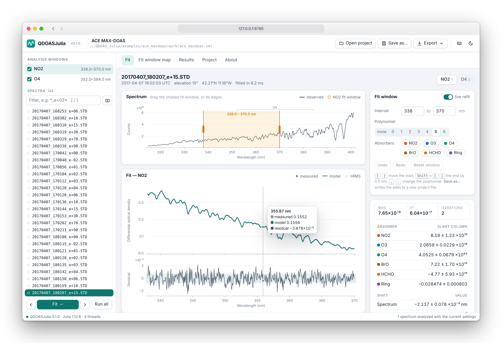
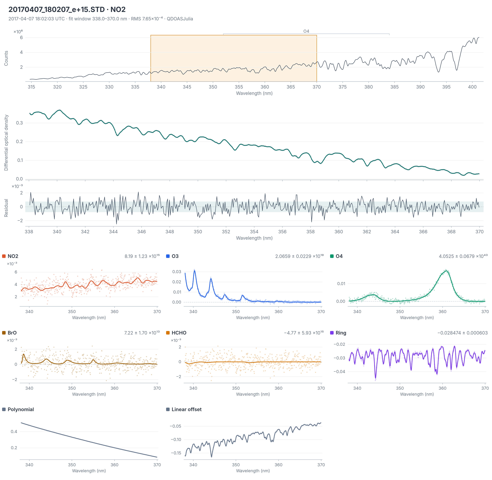
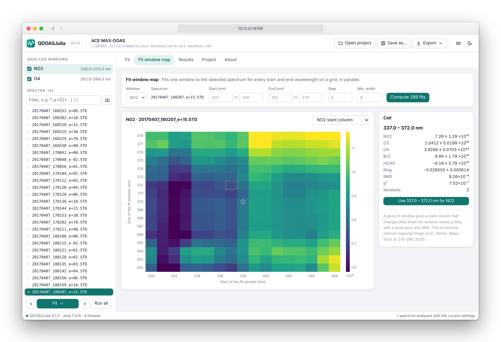
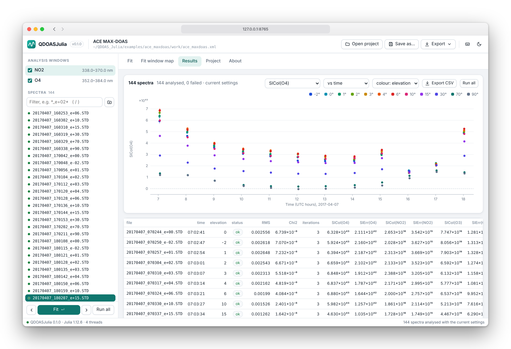
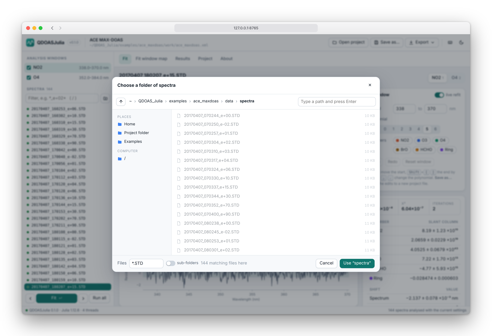

# QDOASJulia

**A Julia port of the QDOAS DOAS spectral analysis: the same slant columns as QDOAS, to
floating-point precision, one to two orders of magnitude faster, on any operating system.**

QDOASJulia reads the project files you create with [QDOAS](https://uv-vis.aeronomie.be/software/QDOAS/)
(the DOAS software of BIRA-IASB and S[&]T), fits your spectra with QDOAS's own optical-density
algorithm, and writes the results in QDOAS's NetCDF layout, so tools that read QDOAS output
keep working. It comes with a command-line tool that works like QDOAS's `doas_cl`, a Julia
API, and a local **web GUI** in which you can step through spectra, drag the fit window and
see the fit change instantly, map how the results depend on the fit window, and export
everything as CSV, NetCDF, SVG or PNG.

<p align="center"><a href="docs/img/gui_fit.png"></a></p>

*The GUI on a real, public MAX-DOAS spectrum (ACE expedition, 7 April 2017, 15° elevation):
the observed spectrum with the draggable fit window, the optical-density fit with the
residual, the fit-window controls and the slant columns. Each fit takes a few milliseconds.*

---

## Contents

1. [Credits and relationship to QDOAS](#credits-and-relationship-to-qdoas)
2. [Requirements](#requirements)
3. [Installation](#installation)
4. [Quick start](#quick-start)
5. [Example with real data](#example-with-real-data)
6. [The web GUI](#the-web-gui)
7. [Using your own QDOAS project](#using-your-own-qdoas-project) — [input files and folder layout](#input-files-and-folder-layout) · [command line](#command-line) · [Julia API](#julia-api)
8. [Which QDOAS options are supported](#which-qdoas-options-are-supported)
9. [Output files](#output-files)
10. [How it works: the physics](#how-it-works-the-physics)
11. [How it works: the numerical method](#how-it-works-the-numerical-method)
12. [Accuracy: validation against QDOAS](#accuracy-validation-against-qdoas)
13. [Why it is faster than QDOAS](#why-it-is-faster-than-qdoas)
14. [Behaviour inherited from QDOAS](#behaviour-inherited-from-qdoas)
15. [Repository layout](#repository-layout)
16. [Testing and contributing](#testing-and-contributing)
17. [References](#references)
18. [License and author](#license-and-author)

---

## Credits and relationship to QDOAS

**QDOAS** is developed at the Royal Belgian Institute for Space Aeronomy (**BIRA-IASB**) and
**S[&]T**, and is free software under a BSD-3-Clause license
(<https://uv-vis.aeronomie.be/software/QDOAS/>, source at
<https://github.com/UVVIS-BIRA-IASB/qdoas>). All the science and all the algorithms in this
package are theirs: QDOASJulia was written by reading the QDOAS 3.7.5 source code and
reproducing the analysis routine by routine (see the list in [NOTICE.md](NOTICE.md)). The
fitting code is unchanged between QDOAS 3.7.5, against which this port was validated, and
QDOAS 3.7.13, the latest version at the time of writing.

QDOASJulia is **independent work**. It is not affiliated with, reviewed or endorsed by
BIRA-IASB or S[&]T; please report problems with it here, not to the QDOAS team. QDOAS
itself does far more than this port: it has a full graphical user interface, satellite and
many ground-based file formats, wavelength calibration, convolution, molecular ring and
undersampling tools, AMFs and more. QDOASJulia covers the ground-based optical-density
analysis described below, and refuses anything else rather than approximating it.

If you use QDOASJulia in published work, please cite QDOAS (see [References](#references))
as well as this repository.

---

## Requirements

* **Julia 1.9 or newer** (developed and tested with Julia 1.12). Julia runs on Windows,
  macOS and Linux, on x86-64 and ARM.
* The Julia packages listed in `Project.toml` (NCDatasets, HTTP, JSON3). They are installed
  automatically; NetCDF and HDF5 come as prebuilt binaries with NCDatasets, so **nothing needs
  to be installed on the system** besides Julia itself.
* For the GUI: any modern web browser (Chrome, Edge, Firefox, Safari).
* Optional: QDOAS's command-line program `doas_cl`, only if you want to compare the two
  (`validation/compare_with_qdoas.jl`).
* For the real-data example: an internet connection once, to download public cross sections.
* Memory: a few hundred MB (a 200-spectrum batch peaked at 0.6 GB for the whole Julia
  process, including the GUI and NetCDF libraries).

---

## Installation

**1. Install Julia** with the official installer *juliaup* (<https://julialang.org/install/>):

* Windows: `winget install --name Julia --id 9NJNWW8PVKMN -e -s msstore`
  (or the installer from the Microsoft Store / julialang.org)
* macOS and Linux: `curl -fsSL https://install.julialang.org | sh`

**2. Get QDOASJulia:**

```bash
git clone https://github.com/mahantsunandan/QDOAS_Julia.git
cd QDOAS_Julia
```

(or download the repository as a ZIP file and unpack it).

**3. Install the dependencies** (once; takes a minute or two the first time):

```bash
julia --project -e "using Pkg; Pkg.instantiate()"
```

**4. Check that everything works** (optional):

```bash
julia --project -e "using Pkg; Pkg.test()"
```

All commands are the same on Windows (PowerShell or Command Prompt), macOS and Linux. Run them
from the `QDOAS_Julia` folder, or replace `--project` by `--project=/path/to/QDOAS_Julia`.

---

## Quick start

Two example data sets come with the repository.

**Real spectra** (details in [Example with real data](#example-with-real-data)):

```bash
julia --project examples/ace_maxdoas/prepare.jl          # once: downloads the cross sections
julia --project -t auto examples/run_gui.jl ace           # opens the GUI on 144 real spectra
```

**Synthetic spectra** with known true slant columns:
[`examples/synthetic_data.jl`](examples/synthetic_data.jl) generates a complete QDOAS project:

* an MFC STD instrument with 1024 pixels (295–348 nm) and a dark/offset file,
* a solar-like reference spectrum with Fraunhofer lines, and a Ring (rotational Raman) term,
* synthetic SO₂, O₃ and NO₂ cross sections (smooth analytic shapes of realistic magnitude,
  **not laboratory data**),
* 12 spectra of an SO₂ plume passing through the view, with a wavelength shift of the
  spectrometer, broadband attenuation and photon noise,
* a QDOAS project with two analysis windows (SO₂ at 303–318 nm, NO₂ at 328–345 nm) that QDOAS
  itself opens and analyses,
* the true slant columns (`truth.csv`), so you can see how well the fit recovers them.

```bash
julia --project -t auto examples/quickstart.jl
```

writes the data set to `examples/synthetic/`, prints the fit of one spectrum, fits all 12
(in parallel) and compares them with the truth:

```
spectrum        SO2 fitted ± error          SO2 true     NO2 fitted ± error        NO2 true
S0000001.STD   1.976e+16 ± 3.8e+14   2.077e+16    6.897e+15 ± 3.3e+14   6.959e+15
...
S0000006.STD   3.999e+17 ± 3.8e+14   3.999e+17    6.648e+15 ± 3.9e+14   6.282e+15
...
```

and saves `results.csv` and one NetCDF file per spectrum in `examples/synthetic/results/`.
`julia --project -t auto examples/run_gui.jl synthetic` opens it in the GUI.

---

## Example with real data

[`examples/ace_maxdoas/`](examples/ace_maxdoas/) analyses **real MAX-DOAS spectra** measured
on the research vessel *Akademik Tryoshnikov* during the Antarctic Circumnavigation
Expedition, published on Zenodo by Benavent et al. (2020,
[doi:10.5281/zenodo.3827443](https://doi.org/10.5281/zenodo.3827443), CC BY 4.0). The
repository holds 144 of them (one elevation scan per hour on 7 April 2017, off Portugal, 12
viewing elevations from −2° to 90°) plus a noon zenith reference, converted to the MFC STD
format QDOAS reads; the conversion script and exactly what was changed are described in
[the example's README](examples/ace_maxdoas/README.md).

`examples/ace_maxdoas/prepare.jl` then does what you would do for a new instrument:

1. downloads the laboratory cross sections of NO₂, O₃, O₄, BrO and HCHO from the MPI-Mainz
   UV/VIS Spectral Atlas and the high-resolution solar spectrum of Chance and Kurucz (2010);
2. calibrates the instrument's wavelengths and slit width against the solar spectrum, as
   QDOAS's Kurucz calibration does (shift of +0.06 to +0.33 nm, slit FWHM 0.37 nm);
3. convolves the cross sections with the slit and computes a Ring spectrum with QDOAS's own
   Ring algorithm;
4. writes a QDOAS project with an NO₂ window (338–370 nm) and an O₄ window (352–384 nm).

QDOAS 3.7.5 opens and runs the same project, and agrees with QDOASJulia to a median of
3.5 × 10⁻¹¹ of the fit errors on all 144 spectra (see [Accuracy](#accuracy-validation-against-qdoas)).

<p align="center"><a href="docs/img/fit_figure.svg"></a></p>

*The figure the GUI exports (Export → Figure) for the spectrum above: the observed spectrum
and fit windows, the differential optical density with the model and residual, and each
absorber's fitted optical depth (line) against the measured one (dots: the absorber plus the
residual), with its slant column and error. Also as vector graphics:
[fit_figure.svg](docs/img/fit_figure.svg).*

---

## The web GUI

```bash
julia --project -t auto bin/qdoasjl.jl --gui myproject.xml      # or without a project
julia --project -t auto examples/run_gui.jl ace                 # an example
julia --project -t auto -e "using QDOASJulia; serve_gui(project=\"myproject.xml\")"
```

This starts a small web server on your own computer and opens **http://127.0.0.1:8765/** in
your browser (the next free port if 8765 is taken). It is a single page with no external
resources, so it works offline. It follows QDOAS's workflow:

* **Open project…** (<kbd>Ctrl</kbd>+<kbd>O</kbd>) — pick a QDOAS `.xml` file. The left panel lists
  the analysis windows (with on/off switches) and the spectra, with a filter; the folder
  button next to the filter takes the spectra from any other folder instead
  (<kbd>Ctrl</kbd>+<kbd>Shift</kbd>+<kbd>O</kbd>), with a file-name pattern and optionally its sub-folders.
* **Fit** — select a spectrum and press <kbd>Enter</kbd> (or double-click it); <kbd>↑</kbd>/<kbd>↓</kbd>
  step through the spectra and fit each one, like QDOAS's browse-and-analyse mode. For each
  analysis window you see the spectrum with the fit window (the project's other windows are
  marked above it, stacked in rows where they overlap; click one to show it), the
  optical-density fit and the residual, one panel per absorber, for the polynomial and the
  linear offset, and the slant columns with
  errors, shifts, stretches, offsets, RMS, χ² and iterations. Move the mouse over a plot to
  read its values.
* **Play with the fit window** — drag the shaded fit window on the spectrum (or either of its
  edges), type an interval, pick the polynomial order or click absorbers out of and back
  into the fit. With *live refit* on, the spectrum is fitted again as you change a setting
  (in milliseconds), and each slant column shows its change from the project's own settings
  in units of its error. <kbd>[</kbd> <kbd>]</kbd> and <kbd>Shift</kbd>+<kbd>[</kbd> <kbd>]</kbd> move the start and end of the
  window by 0.5 nm, <kbd>,</kbd> <kbd>.</kbd> change the polynomial order, and
  <kbd>Ctrl</kbd>+<kbd>Z</kbd> undoes.
* **Fit window map** — fits one window to the selected spectrum for every combination of start
  and end wavelength on a grid, in parallel (289 fits in about 0.25 s on four cores), and
  shows any slant column, its error, the relative error, RMS, χ² or the number of iterations
  as a map. A good fit window is one where the result changes little when the window moves
  a little (*retrieval interval mapping*, Vogel et al., 2013). Click a cell to use that window.
* **Results** — every spectrum analysed with the current settings, whether one by one or with
  **Run all** (<kbd>Ctrl</kbd>+<kbd>Enter</kbd>, all listed spectra in parallel): a chart of any
  quantity against time, elevation angle or spectrum number, with error bars and coloured by
  elevation angle for MAX-DOAS data, and the table. Click a point or a row to open its fit.
* **Export** — the results table as CSV (<kbd>Ctrl</kbd>+<kbd>E</kbd>, the same columns as the command
  line), one spectrum's results as CSV or as a QDOAS-layout NetCDF file, the fitted curves of
  a window as CSV (wavelength, measured and model optical density, residual, polynomial and
  each absorber), and the figure as SVG or PNG.
* **Save as…** (<kbd>Ctrl</kbd>+<kbd>S</kbd>) — writes your window changes to a new QDOAS project file
  (the original is never overwritten). The saved file opens in QDOAS itself.
* **Project** — the project's settings and each window's cross sections (with a warning for
  missing files), shift and stretch groups and reference.

Press <kbd>?</kbd> for all keyboard shortcuts and <kbd>D</kbd> for dark mode (light is the default).

<p align="center"><a href="docs/img/gui_map.png"></a></p>

*Fit window map: the NO₂ slant column of one spectrum for 289 fit windows (start 330–346 nm,
end 362–378 nm); the circle marks the project's window, the selected cell's fit is listed
on the right.*

<p align="center"><a href="docs/img/gui_results.png"></a></p>

*Results: O₄ differential slant columns of the 144 ACE spectra through the day, one colour
per viewing elevation; lower elevations see longer light paths through the O₂-rich lower
atmosphere.*

<p align="center"><a href="docs/img/gui_folder.png"></a></p>

*Choosing a folder of spectra: places, drives, recent folders, a file-name pattern and a
count of the matching files.*

| keys | action |
|---|---|
| <kbd>Enter</kbd> | fit the selected spectrum |
| <kbd>↓</kbd> <kbd>↑</kbd> (or <kbd>J</kbd> <kbd>K</kbd>), <kbd>PgDn</kbd> <kbd>PgUp</kbd>, <kbd>Home</kbd> <kbd>End</kbd> | next / previous spectrum (fits it), 10 on / back, first / last |
| <kbd>←</kbd> <kbd>→</kbd>, <kbd>1</kbd>…<kbd>9</kbd> | previous / next analysis window, window 1–9 |
| <kbd>[</kbd> <kbd>]</kbd> · <kbd>Shift</kbd>+<kbd>[</kbd> <kbd>]</kbd> | fit window start · end −/+ 0.5 nm |
| <kbd>,</kbd> <kbd>.</kbd> | polynomial order −/+ 1 |
| <kbd>Ctrl</kbd>+<kbd>Z</kbd> · <kbd>Ctrl</kbd>+<kbd>Shift</kbd>+<kbd>Z</kbd> | undo · redo a window change |
| <kbd>Ctrl</kbd>+<kbd>O</kbd> · <kbd>Ctrl</kbd>+<kbd>Shift</kbd>+<kbd>O</kbd> · <kbd>Ctrl</kbd>+<kbd>S</kbd> | open a project · a folder of spectra · save the project as |
| <kbd>Ctrl</kbd>+<kbd>Enter</kbd> · <kbd>Ctrl</kbd>+<kbd>E</kbd> | run all listed spectra · export the results table (CSV) |
| <kbd>F</kbd> <kbd>M</kbd> <kbd>R</kbd> <kbd>P</kbd> | Fit, fit window Map, Results, Project |
| <kbd>/</kbd> · <kbd>D</kbd> · <kbd>?</kbd> · <kbd>Esc</kbd> | filter the spectra · dark mode · shortcuts · close a dialog |

On a Mac, <kbd>⌘</kbd> works in place of <kbd>Ctrl</kbd>. In the file dialog, <kbd>↑</kbd> <kbd>↓</kbd> select,
<kbd>Enter</kbd> opens, <kbd>Backspace</kbd> goes up a folder, typing a letter jumps to it, and a path
can be typed or pasted.

The GUI can read the files your user account can read and writes the files you ask it to, so
it only accepts connections from the same computer (`127.0.0.1`) and requests from its own
page. Only use `serve_gui(host="0.0.0.0")` on a network you trust.

---

## Using your own QDOAS project

Set up your analysis in the **QDOAS GUI** as usual (spectra, calibration, reference, cross
sections, analysis windows, shift and stretch, outputs), check it runs there, and save the
project (`File → Save`, a `.xml` file). QDOASJulia uses that file as it is. Paths inside it
must be valid on the computer where you run QDOASJulia.

If the project uses an option QDOASJulia does not implement, it tells you which one
(`UnsupportedConfig: ...`) instead of producing different numbers; see
[Which QDOAS options are supported](#which-qdoas-options-are-supported).

### Input files and folder layout

QDOASJulia needs no particular folder layout: the project file names every input with a
path, and those paths may point anywhere. A tidy arrangement that works well (it is what
the examples use) is:

```
my_station/
├── my_project.xml            the QDOAS project (made in the QDOAS GUI)
├── spectra/                  measured spectra, MFC STD, e.g. 20240501_120000.STD
│   └── ...                   (sub-folders are fine if the project asks for them)
├── reference/zenith_noon.ref Fraunhofer reference: wavelength and intensity
├── cross_sections/NO2.xs     one file per absorber (and Ring)
├── calibration/instrument.clb
└── dark_offset/dark.STD      optional, MFC STD
```

The project refers to them as follows (the names are those of the QDOAS GUI):

| file | where in the project | format |
|---|---|---|
| **spectra** | *Raw spectra*: folders with filters (e.g. `*.STD`), single files | MFC STD, below |
| **dark current, offset** | *Instrumental → MFC STD*: dark, offset (optional) | MFC STD |
| **calibration** | *Instrumental → MFC STD*: calibration file | one wavelength (nm) per line, one line per pixel; QDOAS needs it, QDOASJulia takes the wavelengths from the reference |
| **reference** | each analysis window: *Files → reference 1* | two columns, wavelength (nm) and intensity, **exactly one line per detector pixel** (the project's *size*) |
| **cross sections** | each analysis window: *Cross sections* | two or more columns, wavelength (nm) then cross section (e.g. cm² molecule⁻¹); increasing or decreasing wavelength; any sampling (interpolated) — already convolved to the instrument's resolution |

In reference and cross-section files, lines starting with `;`, `#` or `*` are comments, and
columns are separated by spaces or tabs.

**MFC STD spectra** are text files, one spectrum per file:

```
GDBGMNUP                 line 1: anything (not used)
1                        line 2: first pixel (not used)
1340                     line 3: number of pixels N
174501                   lines 4 .. N+3: the counts, one per line (summed over the scans)
...
elev +15 SZA 71.4        spectrum name (the first 20 characters are used)
My spectrometer          spectrometer name   (not used)
My telescope             scanning device     (not used)
04/07/2017               date, in the project's date format (default MM/DD/YYYY)
18:01:57                 start of the exposure, hh:mm:ss (UTC as recorded)
18:02:09                 end of the exposure; the reported time is the middle
0                        two numbers (not used)
0
SCANS 5                  optional: number of scans (used by the offset correction)
int_TIME 6.9             optional: exposure time in s (see "Behaviour inherited from QDOAS")
ExposureTime = 6902.4    optional "key = value" lines anywhere after the header:
NumScans = 5               ExposureTime (ms), NumScans, ElevationAngle, AzimuthAngle,
ElevationAngle = 15        Latitude, Longitude; the angles and position are copied to
Latitude = 42.21           the results table
Longitude = -11.18
```

Files from [`examples/ace_maxdoas/data/spectra/`](examples/ace_maxdoas/data/spectra/) are
complete examples; [`examples/ace_maxdoas/tools/fetch_ace_spectra.py`](examples/ace_maxdoas/tools/fetch_ace_spectra.py)
shows how to convert another instrument's text files to this format.

**Outputs** go wherever you ask: the command line writes into `-o DIR` (default
`./qdoasjl_output`: one `.nc` per spectrum plus `results.csv`); the GUI downloads through
your browser; the Julia API writes the paths you give it.

### Command line

`bin/qdoasjl.jl` works like QDOAS's `doas_cl`:

```bash
julia --project=/path/to/QDOAS_Julia -t auto /path/to/QDOAS_Julia/bin/qdoasjl.jl -c myproject.xml
```

| option | meaning |
|---|---|
| `-c, --config FILE` | QDOAS project file (required) |
| `-a, --project NAME` | project name inside the file; checked, as with `doas_cl -a` |
| `-f, --file SPECTRUM` | spectrum to analyse; repeat for several; wildcards such as `S*.STD` work on every OS. Default: all spectra listed in the project's *raw spectra* |
| `-o, --output DIR` | output directory (default `qdoasjl_output`) |
| `--csv FILE` | summary table (default `DIR/results.csv`) |
| `--no-netcdf` | write only the summary table |
| `-q, --quiet` | no progress messages |
| `--gui [FILE]` | open the web GUI instead (on the project FILE, if given) |
| `--port N`, `--no-browser` | with `--gui`: the port (default 8765), and not opening a browser |
| `-h`, `-V` | help, version |

It writes one NetCDF file per spectrum (`DIR/<spectrum>.nc`, QDOAS layout) and `results.csv`
with one row per spectrum. `-t auto` lets Julia use all CPU cores; spectra are then fitted in
parallel. The exit status is 0 if every spectrum was analysed, 1 if some failed (they are
listed, and marked in the CSV), and 2 for a usage or project error.

The *raw spectra* of the project are expanded as QDOAS does: folders with their filters (for
example `*.STD`, several separated by `;`), with or without sub-folders, individual files,
and `%0`–`%9` path placeholders. The project's dark, offset and calibration files are left out
automatically.

### Julia API

```julia
using QDOASJulia

p = parse_config("myproject.xml")          # read the project once
p.spectra                                  # the spectra it lists

r = analyze(p)                             # its first spectrum...
r = analyze(p; spectrum="S0000123.STD")    # ...or any other one
print_summary(r)                           # RMS, chi², iterations, SCDs ± errors, shifts

w = r.windows[1]                           # one WindowResult per analysis window
w.slcol["SO2"], w.slerr["SO2"]             # slant column and its 1σ error
w.rms, w.chisqr, w.niter                   # fit quality, iterations
w.shift["Spectrum"], w.stretch["Spectrum"] # shift (nm) and stretch
w.residual                                 # residual over the fitting interval

batch = analyze_spectra(p)                 # all spectra, in parallel with julia -t auto
write_csv("results.csv", batch)            # one row per spectrum
write_netcdf("S0000123.nc", r)             # QDOAS-layout NetCDF of one spectrum

r = analyze(p; spectrum=f, curves=true)    # also the fitted curves, for plotting:
c = r.windows[1].curves                    # c.lambda, c.od, c.model, c.residual,
                                           # c.components[i].value (one per fitted term)
```

`analyze` throws `UnsupportedConfig` for options this port does not implement and
`EngineError` where QDOAS itself would fail (for example a spectrum identical to its
reference, or a non-positive intensity inside the fitting interval). `analyze_spectra` never
throws for a single bad spectrum: it records the error and carries on.

---

## Which QDOAS options are supported

QDOASJulia reproduces the **ground-based optical-density fit** of QDOAS. Everything in this
table is implemented and validated; anything else in a project raises `UnsupportedConfig`
with the name of the option, so you never get silently different numbers.

| QDOAS setting | supported |
|---|---|
| Analysis method | Optical density fitting (`ODF`), no fit weighting, wavelength unit nm |
| Instrument file format | MFC STD (`mfcstd`), with dark and offset files, spectrum reversal |
| Interpolation | cubic spline or linear |
| Reference | from a file (`refsel="file"`), one reference per window |
| Cross sections | used as they are, or interpolated to the calibration grid |
| Polynomial | order 0–8 in (λ − λ₀) |
| Linear offset | order 0–8, radiance- or reference-normalised |
| Non-linear offset | orders 0, 1 and 2, fitted or fixed |
| Shift and stretch | on *Spectrum*, *Ref* or groups of cross sections; shift fitted or fixed; stretch of 1st or 2nd order |
| Gaps | yes |
| Several analysis windows | yes; disabled windows are skipped |
| Outputs | name, date, time, RMS, χ², iterations, error flag, residual; SCD, SCD error and scaling factor per cross section; shifts, stretches, offsets, polynomial |

**Not implemented** (use QDOAS for these): other file formats (satellite, ASCII, other
ground-based formats), the Marquardt+SVD method and instrumental fit weighting, Kurucz
wavelength calibration, automatic reference selection and a second reference, convolution of
cross sections (use pre-convolved cross sections), orthogonalisation, AMFs and vertical
columns, fixed or constrained concentrations, molecular ring / undersampling / Raman /
common-residual non-linear terms, low- and high-pass filters, stray-light correction, and
spike removal (the default tolerance, 999.9, is fine; a spectrum that would actually trigger
it is refused).

---

## Output files

### NetCDF

`write_netcdf` (and the command line) writes one file per spectrum in QDOAS's NetCDF-4 layout:

* a group named after the project's *swath name* (QDOAS's default is `QDOAS Results`) with the
  record fields you selected in the project's output page: `Name`, `Date (DD-MM-YYYY)`
  (stored as year, month, day), `Time (hh:mm:ss)` (the middle of the exposure);
* inside it, one group per analysis window, in QDOAS's variable order: `Chi`, `RMS`, `iter`,
  `processing_error`, `residual_spectrum`, then for each cross section `SlCol(X)` and
  `SlErr(X)` (divided by the output scaling factor) with its `Shift`, `Err Shift`, `Stretch`
  and `Err Stretch` when they are stored, the polynomial `SlCol(x0)`…, the non-linear offsets
  `Offset (Constant)`, `Offset (Order 1)`… with their errors, and the shifts of *Spectrum* and
  *Ref*; the group attributes name each cross-section file and the fitting interval;
* fill values and data types as in QDOAS (double fill value 9.9692099683868690e+306, int32
  fill value −2147483647 for counts).

Programs that read QDOAS's NetCDF output read these files unchanged. The attribute `Qdoas`
of the results group says that the file was produced by QDOASJulia.

### CSV

`results.csv` has one row per spectrum: `file, name, date, time, status, error`, then the
viewing `elevation` and `azimuth` angles and the `latitude` and `longitude` when the spectra's
headers give them (`ElevationAngle = …` etc., as QDOAS reads them), then for each window `Window.RMS`, `Window.Chi2`, `Window.iterations`, `Window.SlCol(X)` and
`Window.SlErr(X)` for every fitted term (cross sections, then polynomial coefficients `x0`,
`x1`, …), `Window.Shift(X)`, `Window.Err Shift(X)`, stretches and non-linear offsets. Slant
columns are in the units of the cross sections times length (molecules cm⁻² for cross
sections in cm² molecule⁻¹); shifts are in nm.

---

## How it works: the physics

**Differential Optical Absorption Spectroscopy (DOAS)** measures trace gases from the way they
absorb light. Light passing through the atmosphere is attenuated according to the
Beer–Lambert law,

$$ I(\lambda) = I_0(\lambda)\, \exp\!\Big(-\sum_i \sigma_i(\lambda)\, S_i\Big)\, B(\lambda), $$

where $I_0$ is the light without the absorbers (the **reference** spectrum), $\sigma_i$ is the
absorption **cross section** of gas $i$ (cm² molecule⁻¹), $S_i=\int n_i\,ds$ is its **slant
column density** (SCD, molecules cm⁻², the concentration integrated along the light path),
and $B$ collects everything that varies slowly with wavelength: Rayleigh and Mie scattering,
surface and instrument effects. Taking the logarithm turns this into a linear problem in the
optical depth,

$$ \tau(\lambda) = \ln \frac{I_0(\lambda)}{I(\lambda)} = \sum_i \sigma_i(\lambda)\, S_i + P(\lambda), $$

in which the broadband part is absorbed by a low-order **polynomial** $P$. What remains, the
narrow-band "differential" structure of each gas, identifies it and gives its column. With a
measured reference $I_0$, the columns are **differential** SCDs: relative to the reference.

Real spectra need a few more terms, all of which QDOAS (and this port) can fit:

* **Ring effect** — rotational Raman scattering in the atmosphere fills in Fraunhofer lines
  and is fitted as a pseudo-absorber with its own "cross section".
* **Wavelength shift and stretch** — the spectrometer's wavelength calibration drifts with
  temperature and time, so the spectrum, the reference or the cross sections are allowed to
  move by a small shift (and stretch) in wavelength.
* **Intensity offsets** — stray light or an imperfect dark correction add an unknown intensity
  to $I$; it is modelled either inside the logarithm (non-linear offset) or as an extra linear
  term.

## How it works: the numerical method

This is QDOAS's algorithm, which QDOASJulia follows step by step (source routine names in
brackets; see [NOTICE.md](NOTICE.md)).

**1. Spectrum and corrections** (`MFC_ReadRecordStd`, `MFC_LoadOffset/Dark`). An MFC STD file
holds the counts summed over $n$ scans. The offset file $O$ is subtracted scaled by the number
of scans, and the dark current $D$ (itself corrected for the offset) scaled by scans and
exposure time:

$$ I_j = R_j - O_j\,\frac{n_R}{n_O} - D_j\,\frac{n_R\,t_R}{n_D\,t_D}. $$

**2. Normalisation.** Spectrum and reference are divided by their Euclidean norms; the
resulting constant in the optical depth ends up in the polynomial's constant term and is
removed again when the polynomial is reported.

**3. Fitting interval** (`FNPixel`, `ANALYSE_LoadGaps`). The pixels whose calibrated
wavelengths lie inside the window, minus any gaps, are the $N$ fitted pixels. A margin of
*security gap* pixels (default 10) on either side is kept for interpolating shifted
vectors. $\lambda_0$ is the centre of the window unless the project sets it.

**4. Cross sections** are read from their files and interpolated to the calibration grid
with a natural cubic spline (or linearly), unless they are already on it
(`SPLINE_Deriv2`, `SPLINE_Vector`).

**5. The model for given non-linear parameters $p$** (`ANALYSE_Function`, `ShiftVector`):

* each vector $v$ that has a shift $\Delta$ and stretches $s_1$, $s_2$ is evaluated on a
  displaced grid with its cubic spline $\mathcal{S}_v$,
  $\tilde v(\lambda) = \mathcal{S}_v\big(\lambda - \Delta - s_1(\lambda-\lambda_0) - s_2(\lambda-\lambda_0)^2\big)$
  (internally the stretches are scaled by $\big(\sum(\lambda-\lambda_0)^{2k}\big)^{-1/2}$ for
  better conditioning);
* a non-linear offset is removed from the shifted spectrum,
  $\tilde I \leftarrow \tilde I - \big[o_0 + o_1(\lambda-\lambda_0) + o_2(\lambda-\lambda_0)^2\big]\,\langle \tilde I\rangle$,
  with $\langle\cdot\rangle$ the mean over the fitted pixels;
* the optical depth is $y(\lambda) = \ln \tilde I_0(\lambda) - \ln \tilde I(\lambda)$;
* the **linear model** is
  $$ y(\lambda) = \sum_i S_i\, \tilde\sigma_i(\lambda) + \sum_{k=0}^{K} a_k(\lambda-\lambda_0)^k \;\big[+ \sum_k b_k (\lambda-\lambda_0)^k g(\lambda)\big] + r(\lambda), $$
  where the optional linear offset uses $g=-\langle\tilde I\rangle/\tilde I$ (radiance
  normalised) or $g=\langle I_0\rangle/I_0$ (reference normalised);
* the linear parameters $c=(S_i, a_k, b_k)$ are the least-squares solution
  (`LINEAR_decompose`, `LINEAR_solve`): the columns of the design matrix $A$ are scaled to unit
  length and the system is solved by Householder QR with column pivoting; their covariance is
  $C=(A^\mathsf{T}A)^{-1}$ (computed through a Cholesky factorisation);
* the residual is $r = y - A c$.

**6. Fit quality.**
$\chi^2 = \sum_{j=1}^{N} r_j^2 / (N - n_\text{lin} - n_\text{nonlin})$ (per degree of freedom) and
$\text{RMS} = \sqrt{\sum r_j^2 / N}$.

**7. Non-linear parameters** — shifts, stretches, offsets — by **Levenberg–Marquardt**, exactly
as QDOAS's version of Bevington's `CURFIT` (`Curfit`, `CurfitMatinv`):

* the Jacobian $J_{jk}=\partial r_k/\partial p_j$ is taken by forward differences with steps
  $\delta_j$ from the project (default $10^{-3}$);
* with $\alpha = J^\mathsf{T}J$ and $\beta = -J^\mathsf{T} r$, the scaled matrix
  $\alpha'_{jk}=\alpha_{jk}/\sqrt{\alpha_{jj}\alpha_{kk}}$, $\alpha'_{jj}=1+\lambda$ is inverted
  by Gauss–Jordan elimination with full pivoting, and the step is
  $p_j \leftarrow p_j + \sum_k (\alpha'^{-1})_{jk}\,\beta_k/\sqrt{\alpha_{jj}\alpha_{kk}}$;
* $\lambda$ starts at $10^{-3}$, is multiplied by 10 while a step increases $\chi^2$, and
  divided by 10 after a successful one;
* after each `CURFIT` pass the steps $\delta_j$ are multiplied by 0.4, and passes repeat until
  $|\Delta\chi^2|/\chi^2$ is below the project's *convergence* criterion (default $10^{-4}$) or
  the maximum number of iterations is reached;
* the parameter errors are $\sigma(p_j) = \sqrt{(\alpha'^{-1})_{jj}\,\chi^2/\alpha_{jj}}$.

**8. Results** (`ANALYSE_CurFitMethod`). Slant columns $S_i$ with errors
$\sigma(S_i)=\sqrt{C_{ii}\,\chi^2}$; the polynomial is reported, as QDOAS does, for
$\ln(I/I_0)$ (opposite sign, with the normalisation constant of step 2 taken out of $a_0$);
shifts in nm and stretches in physical units; parameters that are not fitted are reported
with an error of exactly 1, QDOAS's convention; outputs are divided by the project's scaling
factor.

Every routine mirrors its QDOAS counterpart down to the order of floating-point operations
where that matters, which is why the results agree to rounding error rather than just
"closely".

---

## Accuracy: validation against QDOAS

QDOASJulia was compared with QDOAS's `doas_cl` (version 3.7.5) by running both on the same
projects and spectra and comparing every number QDOAS writes.

**Field data** (not included in this repository): 168 spectra from 24 ground-based UV and
visible DOAS instrument configurations, ranging from single-absorber NO₂ windows to projects
with six windows and up to 13 absorbers, with shifts, stretches, offsets and gaps; 686
analysis windows and 7,016 slant columns in total.

| quantity | result |
|---|---|
| slant columns, difference in units of QDOAS's own error | median 5.9 × 10⁻⁹ σ, 99th percentile 2.5 × 10⁻⁴ σ |
| worst slant column | 0.49 σ (see below) |
| iteration counts | identical in 684 of 686 windows |
| NetCDF files | same groups, variables, attributes, types and fill values |

The two exceptions are the same poorly constrained window type (many absorbers with
strongly correlated fitted shifts). There, QDOAS itself moves by up to 0.44 σ and changes its number of
iterations when its input spectrum is changed by one part in 10¹³, so at that level the
answer is decided by floating-point rounding, not by the algorithm; the port follows one of
the two equally valid paths.

**Real public data** (reproducible with this repository): on the 144 ACE MAX-DOAS spectra of
the [real-data example](#example-with-real-data), 288 window fits with 3,888 fitted
parameters agree to a median of 3.5 × 10⁻¹¹ σ (maximum 3.3 × 10⁻⁷ σ), with identical
iteration counts and RMS equal to 2.6 × 10⁻¹² relative.

**Synthetic data** (reproducible with this repository): on the 12 spectra of the example
project, QDOAS and QDOASJulia agree to a median of 1.2 × 10⁻¹² σ (maximum 1.9 × 10⁻¹⁰ σ) over
168 slant columns, with identical iteration counts and RMS equal to 1.6 × 10⁻¹³ relative.

To check your own projects:

```bash
julia --project validation/compare_with_qdoas.jl --doas-cl /path/to/doas_cl -c myproject.xml
```

It runs `doas_cl` and QDOASJulia on each spectrum of the project (or those given with `-f`)
and reports the differences. `doas_cl` needs about 2 GB of memory per run, so spectra are run
one at a time. Setting the environment variable `QDOAS_DOAS_CL=/path/to/doas_cl` also adds this
comparison to `Pkg.test()`.

---

## Why it is faster than QDOAS

Measured on one computer (Intel Core i7-12700H, Linux, QDOAS 3.7.5 `doas_cl`), same projects
and spectra:

| | QDOAS `doas_cl` | QDOASJulia, 1 thread | QDOASJulia, 4 threads |
|---|---|---|---|
| real-data example (2 windows, 5–6 absorbers, 1340 pixels), one spectrum per run | 1.15 s | 6–12 ms | |
| same, all 144 spectra | 7.4 s (≈ 43 ms per additional spectrum) | 0.41 s (2.8 ms per spectrum) | 0.18 s (1.3 ms per spectrum) |
| synthetic project (2 windows, 3 absorbers each), one spectrum per run | 1.27 s | 1.6 ms | |
| same, each additional spectrum of a batch | 14 ms | 2.9 ms (341 spectra/s) | 0.93 ms (1,074 spectra/s) |
| field project (6 windows, up to 13 absorbers), one spectrum per run | 1.9 s | 55 ms | |
| same, each additional spectrum of a batch | 0.47 s | 55 ms | |
| peak memory | 2.1 GB | 0.6 GB for a whole batch run | |

"One spectrum per run" for QDOASJulia is the time of `analyze` in a running Julia session
(the command line's first spectrum also includes Julia's start-up and compilation, a few
seconds).

Where the difference comes from:

1. **No start-up per run.** Each `doas_cl` run reads and checks the whole project, sets up every
   analysis window and allocates about 2 GB before it analyses anything, about 1.3–1.5 s here.
   Programs that call `doas_cl` once per spectrum (as live processing often does) pay that
   every time. QDOASJulia reads the project once and keeps the interpolated cross sections and
   references in memory for all further spectra (they are re-read automatically if a file
   changes).
2. **Parallel spectra.** QDOAS analyses spectra one after the other on one CPU core. Spectra are
   independent, so QDOASJulia fits them on all cores at once (`julia -t auto`); the batch
   throughput grows almost linearly with the number of cores.
3. **Compiled, type-specialised code.** Julia compiles the analysis to native code for the
   exact data types used, and the linear algebra runs in optimised LAPACK/BLAS routines, so
   even on one core each additional spectrum was 5–15 times faster than in QDOAS's batch mode
   in these tests. We have not profiled QDOAS internally, so we do not claim to know exactly
   where its per-spectrum time goes; the algorithm and the number of model evaluations are the
   same in both.

The price is Julia's compilation the first time a function runs in a session: the first
analysis takes 2–3 seconds, every later one milliseconds. Long-running uses (the GUI, a
server, a batch) pay it once.

**Tips.** Start Julia with `-t auto` for batches. `analyze_spectra` sets OpenBLAS to one thread
while it fits spectra in parallel (many small fits are faster that way; results change by at
most about 10⁻¹⁶ relative); if you run your own parallel loops around `analyze`, call
`LinearAlgebra.BLAS.set_num_threads(1)` yourself.

---

## Behaviour inherited from QDOAS

QDOASJulia reproduces QDOAS, including a few behaviours that may surprise:

* **Dark current and `INT_TIME`.** QDOAS 3.7 reads the exposure time of MFC STD files from a
  line starting with `int_TIME` (lower-case "int") or an `ExposureTime =` entry. Many
  instruments write `INT_TIME`; QDOAS then reads an exposure time of 0 and skips the
  dark-current term, relying on the offset correction alone (which uses the number of scans).
  QDOASJulia does exactly the same, so the results match.
* **Polynomial sign.** The reported polynomial describes $\ln(I/I_0)$, not $\ln(I_0/I)$, and its
  constant term includes the normalisation constant, as in QDOAS.
* **Fixed parameters** are reported with an error of 1.
* **One record per NetCDF file.** For MFC STD data each spectrum is a separate file, and QDOAS
  writes one record per output file; QDOASJulia writes one NetCDF file per spectrum.
* **A spectrum identical to its reference** is an error, as in QDOAS.

---

## Repository layout

```
QDOAS_Julia/
├── Project.toml            package description and dependencies
├── src/
│   ├── QDOASJulia.jl       module, exports, error types
│   ├── config.jl           QDOAS project files (.xml), the project's spectra list
│   ├── spectra.jl          MFC STD spectra, dark/offset, references, cross sections
│   ├── numerics.jl         cubic splines, pixel search, normalisation
│   ├── fit.jl              the model function and the Levenberg–Marquardt fit
│   ├── results.jl          per-window results and fitted curves, QDOAS's output layout
│   ├── analysis.jl         analyse one spectrum, or many in parallel
│   ├── netcdf.jl           QDOAS-layout NetCDF output
│   ├── table.jl            CSV table and printed summaries
│   ├── cli.jl              command-line interface
│   └── gui.jl              web GUI server
├── bin/qdoasjl.jl          command-line entry point (also --gui)
├── gui/index.html          web GUI page (plain HTML/JavaScript, no external libraries)
├── examples/
│   ├── ace_maxdoas/        real MAX-DOAS spectra (CC BY 4.0), prepare.jl, conversion tool
│   ├── synthetic_data.jl   synthetic data set with known truth
│   ├── project_template.jl writes QDOAS project files for the examples
│   └── quickstart.jl, run_gui.jl, benchmark.jl
├── validation/             comparison with QDOAS's doas_cl
├── test/runtests.jl        test suite
└── docs/                   README images (3x resolution; click to enlarge), and
                            tools/make_screenshots.py that makes them
```

---

## Testing and contributing

```bash
julia --project -t auto -e "using Pkg; Pkg.test()"
```

The tests generate the synthetic data set, check that the true slant columns and shifts are
recovered, that serial and parallel analysis agree, the NetCDF and CSV outputs, the command
line, the spectrum header information, the GUI's project editing and its server (fits,
results store, CSV export, batch and fit-window map jobs, saving, file browsing), and that
unsupported QDOAS options are refused. With `QDOAS_DOAS_CL` set they also compare with QDOAS.

Contributions are welcome, particularly further QDOAS options (other file formats,
convolution, filters, spike removal) — each should come with a comparison against `doas_cl`
showing agreement to rounding error, like the existing code. Please open an issue first for
larger changes.

---

## References

* **QDOAS** (please cite when you use QDOASJulia): C. Fayt, T. Danckaert, M. Van Roozendael and
  J. Vlietinck (2026), *QDOAS trace gas retrieval software* (version 3.7.13) [computer
  software], Royal Belgian Institute for Space Aeronomy, <https://doi.org/10.18758/oqvqk2j3>.
  Source code: <https://github.com/UVVIS-BIRA-IASB/qdoas>.
* T. Danckaert, C. Fayt, M. Van Roozendael, I. De Smedt, A. Merlaud, G. Pinardi and
  J. Vlietinck, *QDOAS Software User Manual*, version 3.7.13, BIRA-IASB, 2026
  (<https://uv-vis.aeronomie.be/software/QDOAS/>).
* U. Platt and J. Stutz, *Differential Optical Absorption Spectroscopy: Principles and
  Applications*, Springer, Berlin, 2008.
* L. Vogel, H. Sihler, J. Lampel, T. Wagner and U. Platt (2013), Retrieval interval mapping:
  a tool to visualize the impact of the spectral retrieval range on differential optical
  absorption spectroscopy evaluations, *Atmos. Meas. Tech.* 6, 275–299,
  doi:10.5194/amt-6-275-2013 (the fit window map).
* K. V. Chance and R. J. D. Spurr (1997), Ring effect studies: Rayleigh scattering, including
  molecular parameters for rotational Raman scattering, and the Fraunhofer spectrum,
  *Appl. Opt.* 36, 5224–5230 (the Ring spectrum of the real-data example).
* Real-data example: N. Benavent, D. Garcia-Nieto, C. A. Cuevas and A. Saiz-Lopez (2020), raw
  MAX-DOAS spectra of the Antarctic Circumnavigation Expedition, Zenodo,
  doi:10.5281/zenodo.3827443 (CC BY 4.0); cross sections and solar spectrum as listed in
  [examples/ace_maxdoas/README.md](examples/ace_maxdoas/README.md).
* P. R. Bevington and D. K. Robinson, *Data Reduction and Error Analysis for the Physical
  Sciences*, McGraw-Hill (the `CURFIT` Levenberg–Marquardt routine).
* W. H. Press, S. A. Teukolsky, W. T. Vetterling and B. P. Flannery, *Numerical Recipes*,
  Cambridge University Press (cubic splines).

---

## License and author

**In short: QDOASJulia is open source and anyone may use it**, for any purpose including
commercial work, modify it and share it, as long as the copyright and license notices stay
with the code. Nobody needs to ask permission.

| part | license | what it asks of you |
|---|---|---|
| the code (`src/`, `bin/`, `gui/`, `examples/*.jl`, tools, tests) | BSD-3-Clause (this project, and QDOAS for the parts derived from it) | keep the copyright notice and disclaimer; do not use the authors' names to promote your product |
| the example spectra (`examples/ace_maxdoas/data/`) | CC BY 4.0 (Benavent et al. 2020) | if you redistribute them, credit the data set and say what you changed |
| cross sections, solar spectrum | not in the repository; downloaded by `prepare.jl` | cite their authors when you use them |

CC BY 4.0 is an open-data license, so the examples do not restrict anyone's use of the
program; they only carry their own credit line. Remove `examples/ace_maxdoas/data/` and the
code is entirely BSD-3-Clause.

QDOASJulia is released under the **BSD-3-Clause license** ([LICENSE](LICENSE)). The parts
derived from QDOAS are also covered by QDOAS's BSD-3-Clause notice, reproduced in
[NOTICE.md](NOTICE.md) together with credits.

**Author:** Sunandan Mahant — <sunandanmahant@outlook.com>
